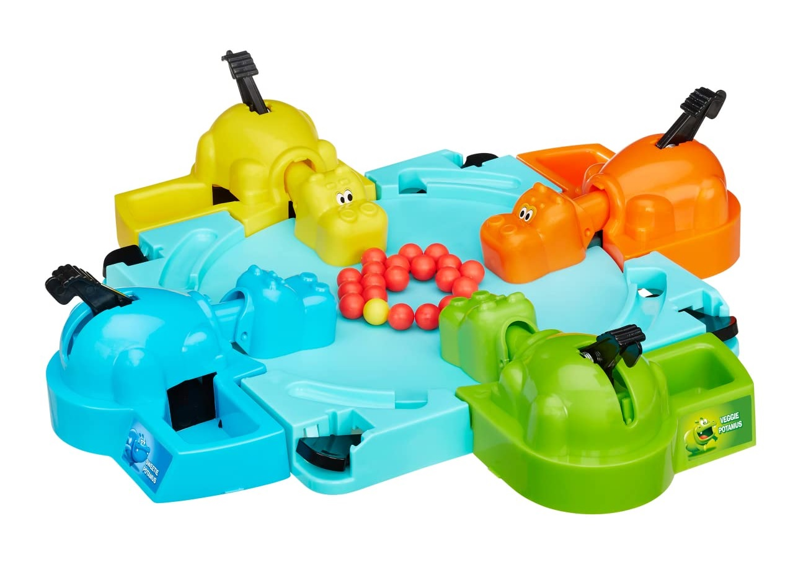
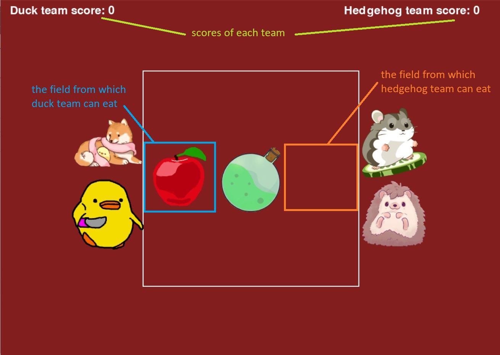

# Hungry hippos but hippos are duck, hedgehog, dog and hamster

## Description
This project aimed to develop a simple game in Python using the Pygame library. The game was inspired by the popular game "Hungry Hungry Hippos" and aimed to demonstrate the usage of threads and critical sections.

## Interface and gameplay
Unlike the original game, in our version pets are divided into two groups. This simplification was made to make game more comfortable while playing on one device. Each team has its eating range, it is one field next to certain pets (see *Image 2* below). There is an apple and a poison, both objects are appearing in random place on the board. Eating an apple gives +1 point while eating poison takes 5 points from the team. The game ends when a team has score below 0. To catch (eat) an object simply press "H" or "D" (H - hedgehog, D - duck) on your keyboard when object is in your range.

 

*Image 1: Original "Hungry hungry hippos" game*

*Image 2: An illustration showcasing our version of the game and its UI*

## Multithreading

### Threads
Threads are used to perform various tasks simultaneously and in parallel. In this game,  two threads are created: "apple_thread" and "posion_thread". Each of these threads performs a function responsible for generating food locations (apple or poison) for the duck and hedgehog teams. Using threads allows these elements to be generated simultaneously and keeps the game running smoothly.

### Critical Sections
A critical section is a piece of code that can only be excecuted by one thread at a time. The access to shared data must be cotrolled to avoid multiple threads accesing them simultaneously and the potential problems of competing access to these resources. In this game, the critical section includes logic related to updating team scores and it is protected with lock. Lock ensures that only one thread can perform operations on the critical section at a time. This synchronization mechanis is used to ensure the correctness of operations modifying team results, eliminating the problem of potential conflicts. Also, when one team is "eating", time for next spawns of objects is longer than usual because game freezes for a moment so players can see results of their action. It could potentially give an advantage to antoher player, for example, imagine situation when both teams have object in their range, one team has an apple and second has a poison. If the second player made a mistake and ate poison, first player will have much more time to take action and gain 1 point. To avoid this situation and make game even more exciting, we are using lock on the score of another player while eating anything. Therefre during one iteration of object spawn only one player is able to gain or lose points, the fastest one.

# Authors
- Maja Tkaczyk 259145 
    
- Bartosz Kloc   259175
    

